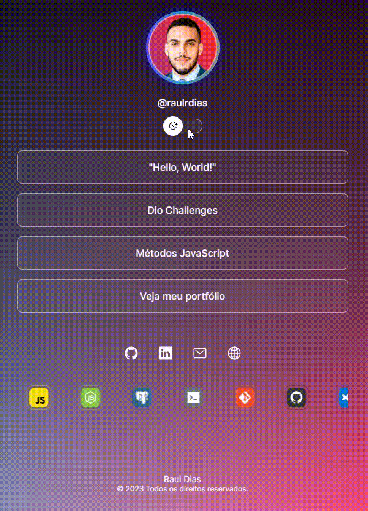

# 🌟 Agregador de Links - Cartão de Visitas Online

Este é um projeto de Agregador de Links que funciona como um Cartão de Visitas Online pessoal. Ele exibe informações sobre você e seus links importantes em um design simples e elegante.

Programa exclusivo e gratuito, promovido pela Rocketseat para ensino de tecnologias WEB.  

  

 

  

## 🛠️ Tecnologias

Esse projeto foi desenvolvido com as seguintes tecnologias:

- HTML e CSS
- JavaScript
- Git e Github
- Figma

## 🚀 Como Usar

1. Faça um fork deste repositório ou clone-o para o seu ambiente de desenvolvimento.
2. Personalize o arquivo `index.html` com suas próprias informações e links.
3. Adicione ou remova links da lista de links conforme necessário.
4. Personalize o arquivo `style.css` para ajustar o estilo do seu cartão de visitas.
5. Você pode adicionar ou remover ícones de redes sociais na seção de links sociais.
6. Adicione imagens ao diretório `assets` e atualize os caminhos das imagens no arquivo `index.html` conforme necessário.
7. Personalize o footer com seus próprios detalhes de direitos autorais.

## ⚙️ Pré-requisitos

- Navegador Web moderno

## 🔥 Detalhes do Projeto
- Efeito avatar

- Dark Mode

- Ferramentas

## 💻 Projeto

O DevLinks é um agregador de links para usar como cartão de visitas online.

- [Acesse o projeto finalizado, online](https://raulrdias.github.io/projeto-devlinks/)

## 📝 Licença

Esse projeto está sob a licença MIT.

<a href="https://lp.rocketseat.com.br/devlinks/inscricao?utm_source=github&utm_medium=descricao&utm_campaign=capture-devlinks&utm_term=organic&utm_content=descricao-github-mayk-brito">Estude esse projeto em formato de vídeo clicando aqui.</a> by Rocketseat

---
Feito com ♥ 
